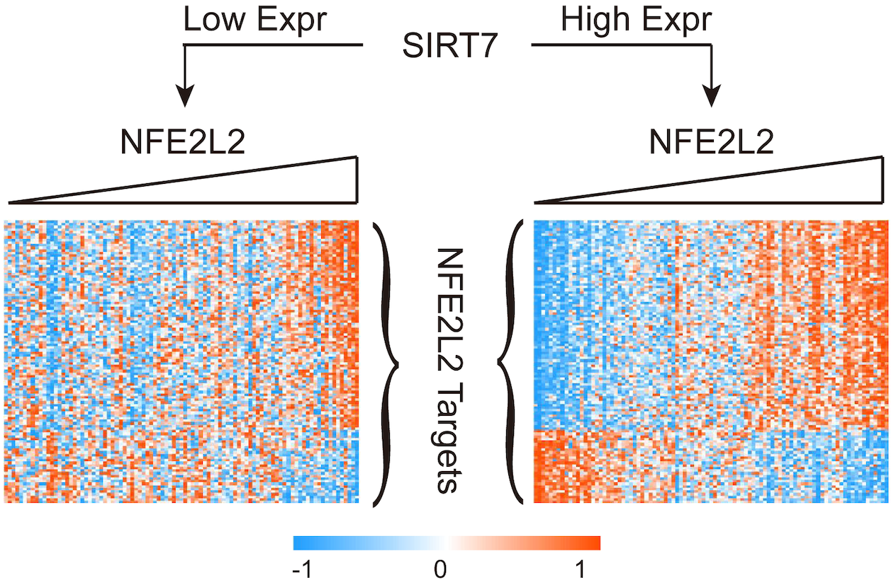
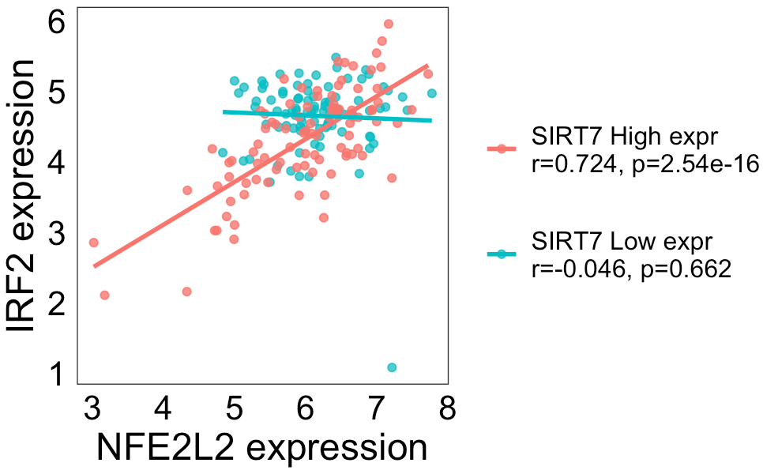

<!-- README.md is generated from README.Rmd. Please edit that file -->

# ModReg (Modulation of transcriptional regulation)

The goal of ModReg is to infer whether a modulator activates or inhibits
the activity of a regulator. The hypothesis here is that if a modulator
can control the function of a regulator, the modulator’s expression
level would affect the correlation between the regulator and its
targets. For example, chromatin factors can modulate the chromatin
architecture to affect the function of transcription factors in response
to intrinsic and extrinsic signalling cues. In our
<a href="https://academic.oup.com/bioinformatics/article/35/11/1805/5144669" target="_blank">study</a>,
we found that SIRT7, a type of histone deacetylase, is able to activate
the activity of transcription factor NFE2L2 in liver cancer because high
levels of SIRT7 expression can result in stronger correlations between
NFE2L2 and its targets, as shown in the tutorial below.

## Installation

You can install the development version of `ModReg` from
[GitHub](https://github.com/beibeiru/ModReg) with:

``` r
# install.packages("devtools")
devtools::install_github("beibeiru/ModReg")
```

## Tutorial

This example shows how to infer the modulation relation between SIRT7
and NFE2L2 using the TCGA liver cancer dataset. Also, two visualization
functions are designed to present the output of `ModReg` package.

### Run ModReg function

    library(ModReg)

    # load example data
    load(file.path(system.file(package = "ModReg"), "extdata/exampleData.rda"))

    # show loaded data
    ls()
    ## [1] "exprMatrix" "modulator"  "regulator"  "regulon"    "target" 

    # TCGA LIHC RNA-Seq data
    head(exprMatrix[,1:3])
    ##          TCGA.2V.A95S.01 TCGA.2Y.A9GS.01 TCGA.2Y.A9GT.01
    ## A1BG            9.507621       9.4190609     11.30630809
    ## A1BG-AS1        2.619266       1.8605297      3.28726563
    ## A1CF            4.252538       5.5715862      5.38414905
    ## A2M            13.191258       9.8801464      9.31354503
    ## A2M-AS1         3.954040       0.1739792      0.05847934
    ## A4GALT          1.394355       2.3000737      1.95371228

    # Regulon (target genes) of NFE2L2
    head(regulon)
    ## [1] "RENBP"  "RGSL1"  "MMADHC" "RNF13"  "RNFT1"  "RNFT2" 

    # run ModReg
    ModReg_obj <- ModReg(exprMatrix, modulator="SIRT7", regulator="NFE2L2", regulon)

    # show the output of ModReg
    str(ModReg_obj)
    ## List of 5
    ##  $ modulator.regulator       :'data.frame':  1 obs. of  8 variables:
    ##   ..$ modulator     : chr "SIRT7"
    ##   ..$ mode          : chr "activate"
    ##   ..$ regulator     : chr "NFE2L2"
    ##   ..$ signif_ratio  : num 0.643
    ##   ..$ activate_ratio: num 0.643
    ##   ..$ inhibit_ratio : num 0
    ##   ..$ dami          : num 0.129
    ##   ..$ dami_p        : num 0
    ##  $ modulator.regulator.target: num [1:168, 1:7] -0.046 0.1553 0.1893 0.0936 0.4036 ...
    ##   ..- attr(*, "dimnames")=List of 2
    ##   .. ..$ : chr [1:168] "IRF2" "RBL2" "TBC1D23" "CCDC121" ...
    ##   .. ..$ : chr [1:7] "modulator_low_r" "modulator_low_p" "modulator_high_r" "modulator_high_p" ...
    ##  $ regulon                   : chr [1:168] "RENBP" "RGSL1" "MMADHC" "RNF13" ...
    ##  $ cutoff.modulator          : num 0.25
    ##  $ permut_num                : num 1000

    # Modulation relation
    ModReg_obj$modulator.regulator
    ##       modulator     mode regulator signif_ratio activate_ratio inhibit_ratio      dami dami_p
    ## Value     SIRT7 activate    NFE2L2    0.6428571      0.6428571             0 0.1294076      0

    # The correlation between NFE2L2 and its regulon under the low and high level of SIRT7 expression.
    head(ModReg_obj$modulator.regulator.target)
    ##         modulator_low_r modulator_low_p modulator_high_r modulator_high_p    diff_z       diff_p    diff_padj
    ## IRF2        -0.04599914    6.615081e-01        0.7236200     2.536316e-16  6.448156 1.132194e-10 1.902086e-08
    ## RBL2         0.15532064    1.371105e-01        0.7886838     6.255371e-21  6.113533 9.744920e-10 8.185733e-08
    ## TBC1D23      0.18925325    6.923779e-02        0.7795143     3.459080e-20  5.719207 1.070227e-08 5.993269e-07
    ## CCDC121      0.09356243    3.723719e-01        0.7128720     1.098306e-15  5.360945 8.278766e-08 3.444419e-06
    ## SEPT10       0.40361910    6.026098e-05        0.8400530     6.694026e-26  5.322213 1.025125e-07 3.444419e-06
    ## LIMD2       -0.08778239    4.027554e-01       -0.6987483     6.828116e-15 -5.211212 1.876114e-07 5.253118e-06

### Modulator-Regulator Visualization

The output shows that SIRT7 activates transcriptional regulation of
NFE2L2. `plotModReg` can be used to visualize this modulation relation.
The left and right panels present the patient group with low (M−) and
high (M+) level of SIRT7 expression, in which rows are targets and
columns are patient samples, respectively. In each patient group (M− or
M+), the samples are sorted based on NFE2L2 expression level.

    plotModReg(exprMatrix,ModReg_obj)



### Modulator-Regulator-Target Visualization

In current example, 64.3% transcriptional targets of NFE2L2 could be
activated by high level of SIRT7 expression (adjusted p\<0.05).
`plotModRegTar` can be used to visualize any tripartite relation of
interest. For example, NFE2L2 has significant different correlations
with its target IRF2 dependent on SIRT7 expression level.

    plotModRegTar(exprMatrix, modulator="SIRT7", regulator="NFE2L2", target="IRF2")



## Supplementary Notes

ModReg is comprised of two steps. At first, all tripartite relations of
Modulator-Regulator-Target were estimated based on differential
correlation analysis. Specifically, all tumor samples were separated
into the top (M+) and bottom (M−) 25% of samples in which the modulator
was most and least expressed. In these two sets (M+ and M−), the
significance of differential correlation relationships between one
regulator and its targets were quantified using the difference in
z-scores by Fisher z-transformation. A two-sided p value can be
calculated using the standard normal distribution, and
Benjamini–Hochberg method was used to adjust P-values for multiple
hypothesis tests. Significant tripartite relations were kept for the
next step (adjusted p\<0.05).

Secondly, ModReg calculated the differential average mutual information
(DAMI) of the significant regulated targets from step 1, which equals to
the difference of average mutual information (i.e., dependence
relationship) of all significant regulated targets between M+ and M−
sample sets. Thus, DAMI quantified how much the modulator was able to
affect the fucntion of the regulator (DAMI \> 0 for activation and DAMI
\< 0 for inhibition, respectively). Permutation test is used to estimate
the empirical distribution of DAMI by randomly selecting a target set of
equal size with the significant regulated targets from the complete
regulon of the regulator, and the associated p value was estimated as
the percentage of random trials with an absolute value of DAMI greater
than the absolute value of the measured DAMI. Based on the DAMI and p
value here, ModReg can determine the modulation mode of the modulator
and the regulator.

## Citation

Beibei Ru, Jianlong Sun, Qingzheng Kang, Yin Tong, Jiangwen Zhang. A
framework for identifying dysregulated chromatin regulators as master
regulators in human cancer. Bioinformatics. 2019; 35(11):1805-1812.
\[<a href="https://academic.oup.com/bioinformatics/article/35/11/1805/5144669" target="_blank">Link</a>\]
